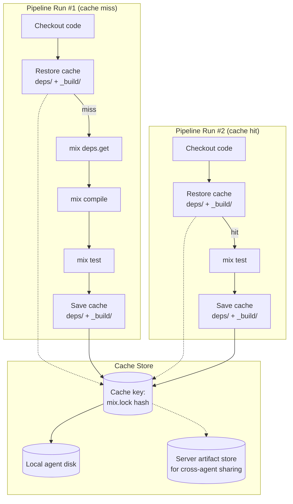

# Artifact Caching Plan

## Research Summary

### GoCD Original: Zip Artifact Cache (Read-Path Optimization)

GoCD has a server-side cache in `com.thoughtworks.go.server.caching.ZipArtifactCache`:

- When a user requests a directory as `.zip`, the server creates a cached zip in `cache/artifacts/pipelines/...` on first request
- Subsequent requests serve the cached zip directly — no on-the-fly re-zipping
- Cache invalidation: when new artifacts are uploaded to the same stage, the cached zip is cleared
- **This is a read-path optimization**, NOT a pipeline-to-pipeline cache

```
{ARTIFACTS_DIR}/
├── pipelines/
│   └── my-pipeline/1/stage1/1/job1/
│       ├── build-output/  (original files)
│       └── cruise-output/
└── cache/artifacts/
    └── pipelines/
        └── my-pipeline/1/stage1/1/  (cached zip)
```

### GitLab CI / GitHub Actions: Pipeline Cache

These platforms have a `cache:` keyword that persists directories between pipeline runs:

```yaml
# GitLab CI example
cache:
  key: $CI_COMMIT_REF_SLUG
  paths:
    - deps/
    - _build/
```

This is fundamentally different from GoCD's approach — it's about speeding up builds by sharing dependencies, not serving downloads faster.

## Our Approach

### Phase 1: Zip Artifact Cache (GoCD Parity)

Server-side caching of directory-as-zip downloads. Mirrors GoCD's `ZipArtifactCache`.

**Implementation:**
- `lib/ex_gocd/artifact_cache.ex` — GenServer managing the cache
- Cache directory: `{ARTIFACTS_DIR}/cache/artifacts/pipelines/{pipeline}/{counter}/{stage}/{stage_counter}/`
- On first `.zip` request for a directory: create cached zip, serve it
- On subsequent requests: serve cached zip directly
- Invalidation: clear cache when new artifacts are uploaded to the same stage
- Configurable via `EX_GOCD_ARTIFACT_CACHE_SIZE_MB` (default 200MB) with LRU eviction
- **Server-side only** — this is built into the server, not a plugin

**Admin UI:**
- Admin page at `/admin/artifact_cache` shows cache size, file count, last cleanup
- Manual "Clear Cache" button for emergency cleanup
- Per-pipeline cache breakdown (size per pipeline/stage)

### Phase 2: Pipeline Build Cache (Plugin)

Cross-run caching of build dependencies. This would be a **plugin** (separate OTP app in `plugins/managed/`), not built into the server. Inspired by GitLab CI `cache:`.

### Phase 2: Pipeline Build Cache (New Feature)

Cross-run caching of build dependencies. Inspired by GitLab CI `cache:`, but GoCD-native.



**Design:**

| Aspect | Detail |
|---|---|
| **Cache key** | SHA256 of `mix.lock` + pipeline name + job name |
| **Paths** | Configurable per job: `cache: [deps/, _build/dev/]` |
| **Storage (single agent)** | Local disk at `{AGENT_WORK_DIR}/cache/{key}/` |
| **Storage (cross-agent)** | Server artifact store via upload/download — same protocol as artifacts |
| **Fallback** | Cache miss → full build (no-op, same as no cache) |
| **Cleanup** | Agent-side LRU eviction, configurable max size |

**Pipeline config (proposed GoCD-native syntax):**

```yaml
# In job config
jobs:
  test:
    tasks:
      - exec: mix test
    cache:
      paths:
        - deps/
        - _build/dev/
      key: mix-lock-{{ checksum "mix.lock" }}
```

**Task types added:**

| Task | Agent Action |
|---|---|
| `restoreCache` | Download cached archive from server, extract to working dir |
| `saveCache` | Archive configured paths, upload to server with cache key |

## Implementation Order

1. **Phase 1**: Zip Artifact Cache (server-side, GoCD parity)
2. **Other P1 items**: Fetch artifact hardening, console activity monitor
3. **Phase 2**: Pipeline Build Cache (new feature)

---

*Plan created 2026-06-30. Based on GoCD source analysis of `ZipArtifactCache` and GitLab CI cache architecture.*
