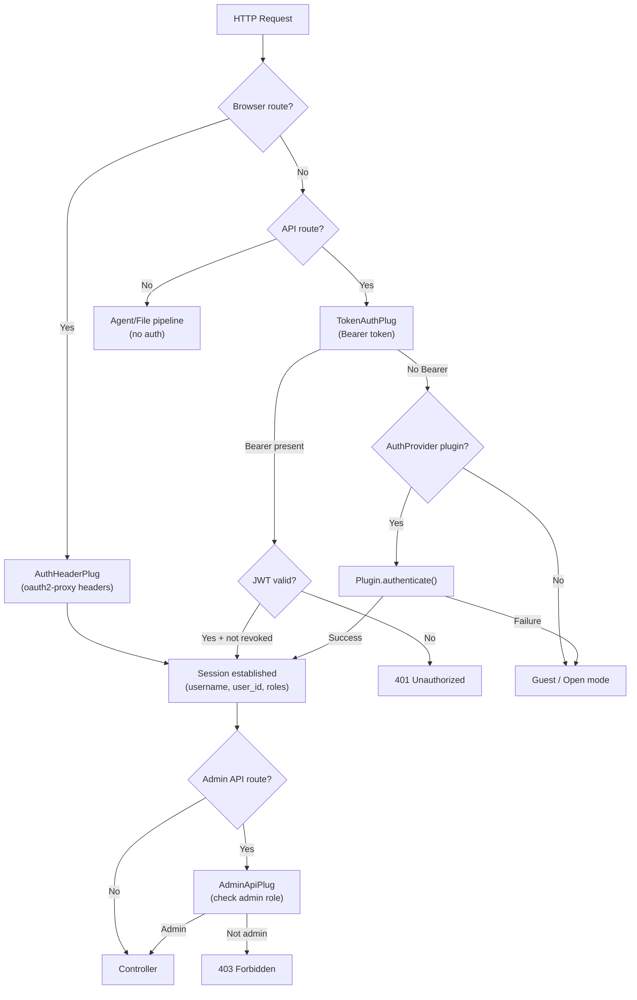
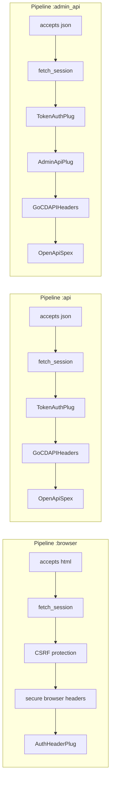
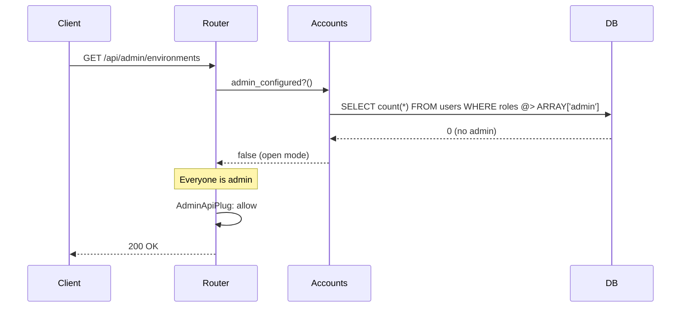
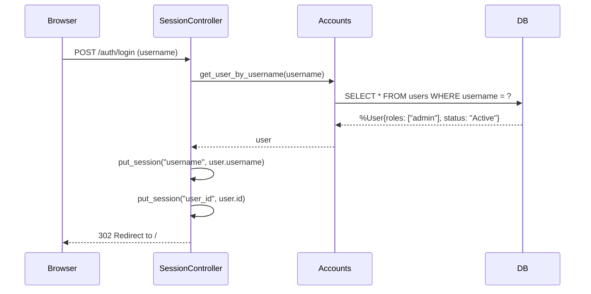
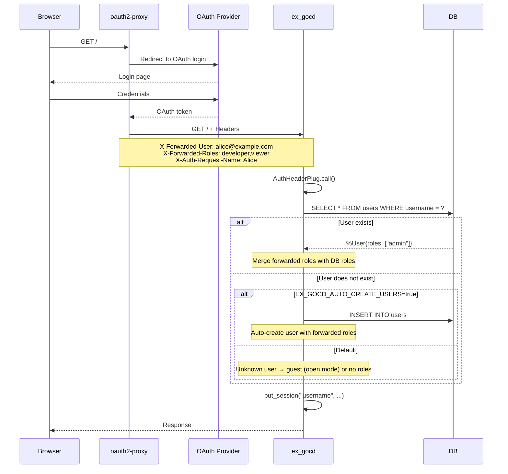
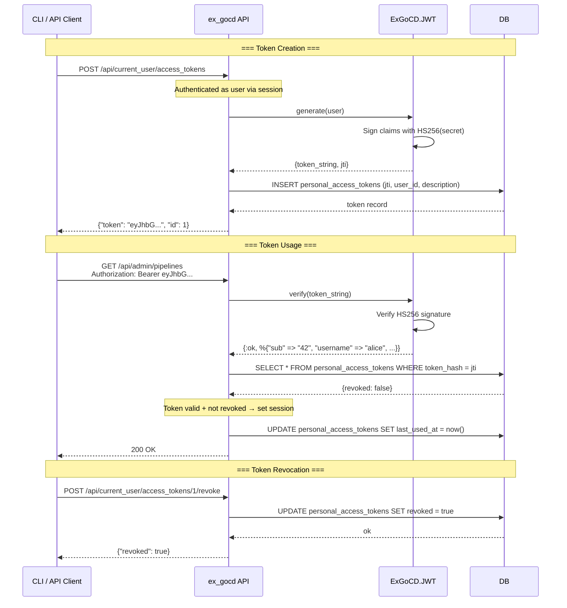
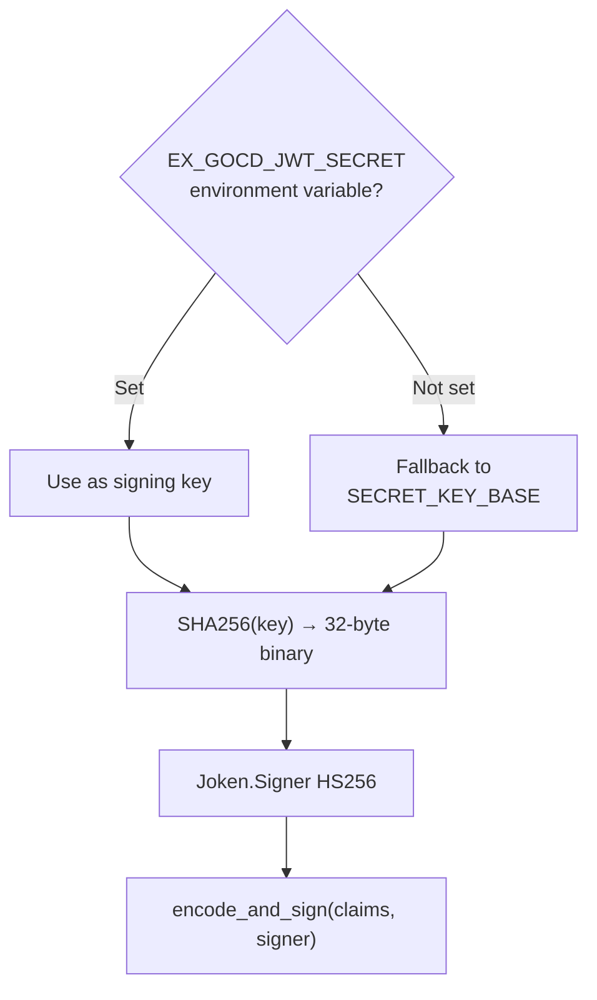

# Authentication & Authorization in ex_gocd

ex_gocd has a layered authentication system mirroring GoCD's security model. The core principle: **the server is the authority**, and multiple auth methods are supported via a plug pipeline.

## Architecture Overview



## Pipelines in the Router



---

## 1. Open Mode (No Admin Configured)

When no user with the `admin` role exists in the database, ex_gocd is in **open mode**. This matches GoCD's behavior when security is disabled.



**Characteristics:**
- All users have full administrative access
- No login required
- Any unauthenticated request is treated as admin
- Once at least one admin user is created, the system transitions to **security mode**

**Implementation:** `ExGoCD.Accounts.admin_configured?/0` (`lib/ex_gocd/accounts.ex:96`)

---

## 2. Custom User Management (Database Users)

When security mode is active (at least one admin exists), ex_gocd uses database-backed user accounts. Users sign in via a simple username-based flow.



**User model** (`lib/ex_gocd/accounts/user.ex`):

| Field | Description |
|---|---|
| `username` | Unique identifier (email-style) |
| `display_name` | Human-readable name |
| `roles` | Array of strings: `["admin"]`, `["viewer"]`, `["developer"]` |
| `status` | `"Active"` or `"Disabled"` |
| `password_hash` | Argon2 hash (optional, for password auth) |

**Roles:**
- `admin` — full access to all admin APIs and UI
- `viewer` — read-only access to pipelines/dashboards
- `developer` — can trigger pipelines, view builds

**Admin check:** `ExGoCD.Accounts.User.has_role?(user, :admin)` (`lib/ex_gocd/accounts/user.ex:32`)

---

## 3. OAuth2-Proxy (AuthHeaderPlug)

When ex_gocd sits behind an oauth2-proxy (e.g., Google OAuth, GitHub OAuth, Keycloak), the proxy injects authentication headers. `AuthHeaderPlug` reads these headers and establishes a session.



**Headers recognized** (`lib/ex_gocd_web/plugs/auth_header_plug.ex`):

| Header | Purpose |
|---|---|
| `X-Forwarded-User` | Primary username |
| `X-Auth-Request-User` | Fallback username |
| `X-Auth-Request-Preferred-Username` | Second fallback |
| `X-Auth-Request-Name` | Display name |
| `X-Auth-Request-Email` | Fallback display name |
| `X-Forwarded-Roles` | Comma-separated roles |
| `X-Forwarded-Groups` | Fallback roles |
| `X-Auth-Request-Groups` | Second fallback roles |

**Environment variables:**

| Variable | Purpose |
|---|---|
| `EX_GOCD_AUTO_CREATE_USERS=true` | Auto-create unknown users from headers |
| `EX_GOCD_ADMIN_USERS=alice,bob` | Comma-separated admin usernames (auto-granted) |

---

## 4. JWT Bearer Token Authentication

For API and CLI access, ex_gocd supports Bearer token authentication using self-issued JSON Web Tokens (JWT). This mirrors GoCD's Personal Access Token model but uses standard JWT instead of salted SHA256 hashes.

### Token Format

```json
{
  "alg": "HS256",
  "typ": "JWT"
}
.
{
  "sub": "42",
  "username": "alice",
  "roles": ["admin", "developer"],
  "iat": 1783446973,
  "jti": "abc123def456"
}
.
[signature]
```

| Claim | Description |
|---|---|
| `sub` | User ID (subject) |
| `username` | Username string |
| `roles` | Array of role strings |
| `iat` | Issued-at timestamp (Unix seconds) |
| `jti` | Unique token ID (for revocation tracking) |

### Token Lifecycle



### Signing Configuration



**Key derivation** (`lib/ex_gocd/jwt.ex:66`):
1. Read `EX_GOCD_JWT_SECRET` env var, or `secret_key_base` from app config
2. Hash with SHA256 to produce a 32-byte key suitable for HS256
3. Create `Joken.Signer` with `"HS256"` algorithm

### Revocation

Unlike pure JWT (which can't be revoked without short expiry), ex_gocd stores each token's `jti` (JWT ID) in the `personal_access_tokens` table:

```sql
-- Schema (simplified)
personal_access_tokens (
  id            SERIAL PRIMARY KEY,
  user_id       INTEGER REFERENCES users,
  description   VARCHAR,
  token_hash    VARCHAR,    -- stores the JWT's 'jti' claim
  revoked       BOOLEAN DEFAULT FALSE,
  revoked_at    TIMESTAMP,
  revoked_by    VARCHAR,
  revoke_cause  VARCHAR,
  last_used_at  TIMESTAMP
)
```

On every verification, the `jti` from the JWT claims is looked up in this table. If `revoked = true`, the token is rejected even if the JWT signature is valid.

---

## Authorization Matrix

| Route Scope | Pipeline | Auth Required | Admin Required |
|---|---|---|---|
| `/` (dashboard, VSM, stage details) | `:browser` | None (guest OK) | No |
| `/admin/*` (LiveView admin pages) | `:browser` → `require_admin` | Session | **Yes** |
| `/api/*` (agents, jobs, public APIs) | `:api` | Token or plugin | No |
| `/api/admin/*` (config, backups, users) | `:admin_api` | Token or plugin | **Yes** |
| `/api/current_user/*` (token management) | `:api` | Session or token | No (user-scoped) |
| `/go/remoting/api/agent/*` | `:api` | Agent protocol | No |
| `/files/*` | `:files_api` | None | No |

---

## Files Reference

| File | Purpose |
|---|---|
| `lib/ex_gocd_web/router.ex` | Pipeline definitions and scope wiring |
| `lib/ex_gocd_web/plugs/auth_header_plug.ex` | oauth2-proxy header authentication |
| `lib/ex_gocd_web/plugs/token_auth_plug.ex` | Bearer token + AuthProvider delegation |
| `lib/ex_gocd_web/plugs/admin_api_plug.ex` | Admin role enforcement (new in GoCD 26.1.0 parity) |
| `lib/ex_gocd/jwt.ex` | JWT generation and verification |
| `lib/ex_gocd/accounts.ex` | User management, token CRUD, role checks |
| `lib/ex_gocd/accounts/user.ex` | User schema and `has_role?/2` |
| `lib/ex_gocd/accounts/personal_access_token.ex` | Token schema (revocation tracking) |
| `lib/ex_gocd_web/live_session.ex` | LiveView on_mount hooks (assign_user, require_admin) |
| `lib/ex_gocd_web/controllers/session_controller.ex` | Login/logout for DB-backed auth |
| `lib/ex_gocd_web/controllers/api/personal_access_token_controller.ex` | Token management API |

---

## GoCD 26.1.0 Security Parity

The security fixes applied (commit `f391489`) bring ex_gocd in line with GoCD 26.1.0:

| GoCD Fix | ex_gocd Implementation |
|---|---|
| API authorization bypass on material notify | `AdminApiPlug` blocks non-admin from admin API endpoints |
| Material notify requires admin auth | `WebhookController.admin_notify/2` checks admin session |
| XSS mitigations | Phoenix LiveView HEEx auto-escaping + `put_secure_browser_headers` |
| Block `/go/admin/restful/*` | N/A — no legacy RESTful endpoints exist in ex_gocd |
| Pipeline Tracking Tool regex | N/A — not implemented in ex_gocd |

---

## Configuration Quick Reference

```bash
# Required for JWT token auth (falls back to SECRET_KEY_BASE)
export EX_GOCD_JWT_SECRET="your-256-bit-secret-here"

# Optional: auto-create users from oauth2-proxy headers
export EX_GOCD_AUTO_CREATE_USERS=true

# Optional: comma-separated list of admin usernames
export EX_GOCD_ADMIN_USERS="alice@example.com,bob@example.com"

# Optional: webhook secret for GitHub/GitLab/Bitbucket push notifications
export GOCD_WEBHOOK_SECRET="your-webhook-secret"
```
