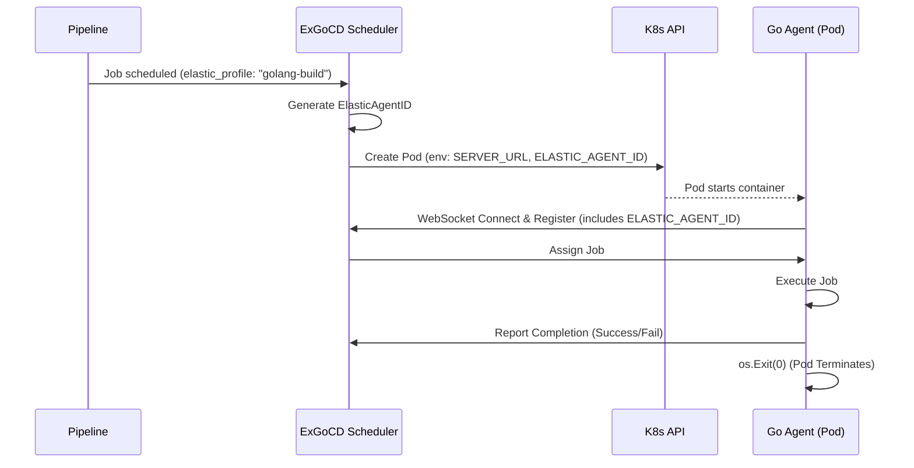

# Comprehensive GoCD Feature Parity Plan

*Audited 2026-06-22. Updated 2026-06-28. 800+ ExUnit tests, 16/16 quality gate.*

> This is the single source of truth. Supersedes: `parity_roadmap_plan.md`, `vsm_parity_plan.md`, `auth_and_env_plan.md`, `external-ci-pipeline-sync-plan.md`.

---

## Part A: Current State — Audited ✅

### API Controllers: 19 controllers, 81 actions across 6 scopes

| # | Controller | Actions | Scopes |
|---|-----------|---------|--------|
| 1 | `API.AgentController` | register, index, show, update, delete, enable, disable | `/api`, `/go/api` |
| 2 | `API.AnalyticsController` | index, show | `/api` |
| 3 | `API.BuildConsoleController` | append | `/api`, `/go/api` |
| 4 | `API.DashboardController` | show | `/api`, `/go/api` |
| 5 | `API.JobController` | schedule, show, history | `/api`, `/go/api` |
| 6 | `API.PersonalAccessTokenController` | index, show, create, revoke | `/api/current_user`, `/go/api/current_user` |
| 7 | `API.PipelineInstanceController` | history, show | `/api`, `/go/api` |
| 8 | `API.PipelineOperationsController` | status, pause, unpause, unlock, schedule, approve_stage | `/api`, `/go/api`, `/` |
| 9 | `API.StageController` | show, history, cancel | `/api`, `/go/api` |
| 10 | `API.StatsController` | show | `/api`, `/go/api` |
| 11 | `API.TestController` | start_agents, start_http_agents | `/api` (test only) |
| 12 | `API.UserController` | index, show, create, update, delete | `/api`, `/go/api` |
| 13 | `API.VersionController` | show | `/api`, `/go/api` |
| 14 | `API.WebhookController` | git_notify, github_notify, gitlab_notify | `/api`, `/go/api` |
| 15 | `API.Admin.BackupController` | create | `/api/admin` |
| 16 | `API.Admin.EnvironmentController` | index, show, create, update, delete | `/api/admin` |
| 17 | `API.Admin.MaintenanceModeController` | show, enable, disable | `/api/admin` |
| 18 | `API.Admin.PipelineConfigController` | show, create, update, delete | `/api/admin` |
| 19 | `API.Admin.TemplateController` | index, show, create, update, delete | `/api/admin` |

### LiveView Pages: 18 modules

| Module | Feature |
|--------|---------|
| `DashboardLive` | Main pipeline dashboard with VSM links |
| `AgentsLive` | Agents listing & status |
| `AgentJobHistoryLive` | Job history for a single agent |
| `AgentJobRunDetailLive` | Detail view of a single agent job run |
| `JobDetailsLive` | Console, Tests, Artifacts, Materials tabs |
| `StageDetailsLive` | Stage details with breadcrumbs → VSM |
| `PipelineActivityLive` | Pipeline run history with VSM and config diff links |
| `PipelineConfigLive` | Pipeline configuration editor |
| `PipelineWizardLive` | Wizard for creating new pipelines |
| `CompareLive` | Compare two pipeline runs with env vars diff |
| `ConfigDiffLive` | Side-by-side config change diff viewer |
| `ValueStreamMapLive` | VSM: trigger info, FI/FO badges, breadcrumbs, responsive, SVG arrows |
| `MaterialsLive` | Materials (SCM) management |
| `AdminLive` | Admin settings / config / dashboard |
| `AdminSchedulingLive` | Scheduling diagnostics: pending + active jobs, agent matching, cross-links |
| `AuditLogLive` | Searchable audit log with filters and resource links |
| `AnalyticsLive` | Built-in CI analytics dashboard |
| `ExternalCIRepoWizardLive` | External CI repo config wizard |

### Core Features Audit

| Feature | Status | Notes |
|---------|--------|-------|
| Scheduler connected? check | ✅ | Checks Phoenix Presence + DB agent state fallback |
| AuthHeaderPlug | ✅ | No auto-bootstrap; nil for unknown users; guest admin when no admin |
| Test report generation | ✅ | JUnit XML → HTML via Erlang xmerl |
| Artifact tree browser | ✅ | Recursive directory listing in JobDetailsLive |
| Console live streaming | ✅ | PubSub-based console subscription |
| Config XML export/import | ✅ | Generate + import via :xmerl parser, UI at /admin/config_xml |
| Config versioning (snapshots) | ✅ | `ConfigVersion` schema + `ConfigSnapshot` capture (all sections, encrypted secrets). Auto-hook on mutations, history UI at `/admin/config_xml`, revert mechanism. |
| MD5 checksums | ✅ | Agent sends checksums; server stores |
| Maintenance mode | 🟡 | Admin UI toggle (local assign); needs server-wide GenServer wiring |
| Stage cancel | ✅ | `cancel_stage/3` with transaction |
| Cycle detection | ✅ | DFS cycle detector on pipeline dependency graph |
| Dashboard API | ✅ | `GET /api/dashboard` |
| Analytics | ✅ | 6 functions: pipeline, agent, VSM trends |
| Backup API | 🟡 | API endpoint exists; admin UI button simulated; needs real pg_dump wiring |
| Environment API | ✅ | Full CRUD |
| Template API | ✅ | Full CRUD |
| Pipeline config API | ✅ | CRUD (show/create/update/delete) |
| User API | ✅ | Full CRUD |
| VSM | ✅ | Trigger info, FI/FO, breadcrumbs, responsive, E2E tests |
| Job instance API | ✅ | GET show/history, POST schedule |
| Stage instance API | ✅ | GET show/history, POST cancel |
| Pipeline instance API | ✅ | GET history/show |
| Agent remoting | ✅ | ping/get_work/report_status |
| Artifacts upload/download | ✅ | `/files/`, `/remoting/files/` |
| SCM polling | ✅ | Git polling, modification storage |
| Webhooks | ✅ | GitHub, GitLab, git notify |
| Fetch artifact task | ✅ | Agent-side protocol support |
| Go agent | ✅ | HTTP remoting agent in `agent/` |
| Config diff | ✅ | `config_diff/2` + `ConfigDiffLive` side-by-side viewer |
| Trigger-time variables | ✅ | GoCD-format `variables` + `secure_variables` maps accepted |
| Audit log UI | ✅ | `AuditLogLive` with search, filters, resource links |
| Scheduling admin | ✅ | `AdminSchedulingLive` with pending + active jobs, cross-links |
| Admin dropdown | ✅ | CSS-driven with JS edge guard; mobile responsive with vertical list + phx-update="ignore" |
| Plugins removed | ✅ | No plugin architecture — ex_gocd bakes in features directly. Removed from UI and nav. |
| Roles CRUD | ✅ | Schema + migration + API at `/api/admin/security/roles`. GoCD parity: `delete_role` validates not-in-use. |

---

## Part B: Remaining Gaps — Prioritized

### 🟡 P1: Completeness Polish

| # | Gap | Effort | Notes |
|---|-----|--------|-------|
| B1 | Pipeline config admin: `index` action handler | ✅ | Done |
| B18 | Admin maintenance mode — wire UI to backend | ✅ | Done — calls `ExGoCD.MaintenanceMode.enable/disable` GenServer |
| B19 | Admin backup — wire UI to backend | ✅ | Done — `ExGoCD.Backup` GenServer with async `pg_dump` via Task |
| B20 | Admin server config — wire UI | 🟡 | Deferred — caused 500 errors in Docker CI |
| B2 | Job comment API: `POST /api/pipelines/:name/:counter/comment` | ✅ | Done |
| B3 | Stage run-failed-jobs / run-selected-jobs APIs | ✅ | `rerun_failed_jobs/4` + 3 tests + API route |
| B4 | Config XML import/export | ✅ | Export + import via :xmerl parser, upload UI at /admin/config_xml |
| B5 | Disk space monitor / artifact auto-cleanup | ✅ | `ExGoCD.Monitors.DiskSpace` GenServer, wired into scheduler checker chain |
| B6 | Artifact MD5 verification on downstream fetch | ✅ | Done |
| B7 | **Config versioning** — full config snapshots with encrypted secrets | ✅ | Schema+migration+snapshot+auto-hook+history UI+revert done. Secrets stored as `AES:iv:ciphertext` (GoCD parity: `encryptedPassword`). |

### 🟢 P2: Other Features

| # | Gap | Effort | Notes |
|---|-----|--------|-------|
| B7 | Full config repos engine (PaC) | XL | YAML parsing, git polling, merge engine |
| B8 | External auth (LDAP/OAuth/GitHub) | L | Ueberauth or :eldap |
| B9 | Pipeline group administration | M | Delegate admin per group |
| B10 | Email notifications | ✅ | `Notifications.dispatch/4` + `ExGoCD.Mailer` (Swoosh SMTP → smtp4dev in dev). Docker compose: smtp4dev on :2525, web UI :8025. |
| B11 | Roles & auth configs CRUD | ✅ | Role schema + migration + CRUD + 10 tests + `delete_role` validates not-in-use (GoCD parity: `RoleConfigDeleteCommand`). API at `/api/admin/security/roles`. |
| B12 | Elastic agent profiles | ✅ | Schema + CRUD API at /api/admin/elastic_agent_profiles |
| B13 | Cluster profiles | ✅ | Schema + CRUD API at /api/admin/cluster_profiles |
| B14 | Package repositories | ✅ | Schema + CRUD API at /api/admin/package_repositories |
| B15 | Secret configs | ✅ | Schema + CRUD API at /api/admin/secret_configs |
| B16 | Plugin info API | ✅ | Metadata endpoint |

### 🔵 P3: Analytics Expansion

| # | Gap | Notes |
|---|-----|-------|
| B17 | Agent state transitions tracking | Schema exists (`agent_transition`) |
| B18 | Agent utilization snapshots | ✅ Done — Schema + periodic GenServer + analytics queries |
| B19 | Pipeline workflow chains | ✅ Done — `Analytics.workflow_chain/1`, upstream/downstream traversal, recursive chains, full adjacency graph. 9 tests. |
| B20 | VSM trend across runs | ✅ Done — Analytics LiveView agents tab shows snapshot cards + hostnames + agent type badges |
| B21 | Analytics UI with charts | ✅ Done — Contex SVG charts on every tab, snapshot summary cards, workflow chain data |

### ⚪ P4: Low Priority / Not Started

| # | Gap |
|---|-----|
| B22 | Feeds XML (pipeline/stage/job RSS) |
| B23 | Mailserver config |
| B24 | Site URLs config |
| B25 | Job timeout config |
| B26 | Notification filters |
| B27 | SCMs API |
| B28 | Permissions API |
| B29 | Artifact stores API |
| B30 | Server health API |

---

## Part C: Priority Matrix

| Priority | Items | Effort | Impact |
|----------|-------|--------|--------|
| **P0** | — | — | ✅ DONE |
| **P1** | Pipeline config index, job comment, stage re-run, disk monitor, XML export, checksum verify | S-M | Completeness |
| **P2** | Config repos, external auth, notifications, roles, elastic agents | L-XL | Enterprise |
| **P3** | Analytics UI, agent utilization, workflow chains, chart integration | M | User delight |
| **P4** | Feeds, mailserver, health, etc. | S-L | Low priority |

---

## Part D: Build & Quality

- **Tests**: 644 ExUnit tests, Go agent tests pass, Cypress E2E suite (108 tests, 15 specs)
- **Quality gate**: `scripts/quality-gate.sh` — compile `--warnings-as-errors`, Credo, Sobelow
- **Compile**: clean with `--warnings-as-errors` on all 146 files
- **Go agent**: `go build`, `go vet`, `go test ./...` — all clean

---

## Part E: VSM — Fully Shipped ✅

See [vsm_parity_plan.md](vsm_parity_plan.md) for full details. All 5 phases complete:
- Phase 1: trigger_info, fan_in, fan_out in data layer
- Phase 2: enriched JSON API inline
- Phase 3: UI with FI/FO badges, trigger panel, clickable nodes
- Phase 4: breadcrumbs, dashboard/activity/stage VSM links
- Phase 5: mobile responsive, aria-labels, Cypress E2E

---

## Part F: Analytics — Parity with gocd-analytics-plugin 🔴

Reference implementation: `../gocd-analytics-plugin/`

GoCD Analytics provides 4 dashboard types. Our `/analytics/global` page needs parity:

### F.1 VSM Analytics
- Pipeline lead time distribution (histogram)
- Material to pipeline completion time
- Bottleneck detection across pipeline chains

### F.2 Pipeline Analytics  
- Pipeline run frequency over time
- Pass/fail ratio charts
- Build duration trends
- Stage/job duration breakdowns

### F.3 Agent Analytics
- Agent utilization over time
- Idle vs building ratio
- Per-agent work distribution charts

### F.4 Global Analytics
- Cross-pipeline overview metrics
- System-wide throughput
- Aggregate success rates

**Status**: `/analytics/global` renders basic stats. Charts and time-series missing.
**Priority**: P2. Depends on agent utilization snapshots and pipeline metric collection.

**Update 2026-06-27**: Charts implemented with **Contex** (server-side SVG) — bar charts on global/pipelines/agents tabs, line charts on pipeline detail/VSM tabs. Zero JS dependency.

### F.5 Pipeline/Stage Stats Embed 🟡
- Pipeline detail pages show embedded charts (not just analytics page)
- Stage detail pages show stage-level trends
- Minute-by-minute build time distribution per pipeline
- Job success rate sparklines in pipeline activity view
**Priority**: P2

### F.6 Gantt Chart View 🟡
- Timeline view of all pipeline runs across groups
- Stage/job overlap visualization for bottleneck detection
- Dependency arrows between pipelines
- Click-to-detail popovers
**Candidate**: `phoenix_live_gantt` v0.4.0 (updated 2026-06-26, MIT, 154 downloads)
**Priority**: P2

---

## Part H: Enhanced Compare Dialog 🟡

GoCD's compare is much more powerful than comparing to the previous material revision:
- User can **select any two pipeline instances** to compare (not just consecutive)
- Dropdown pickers for from/to counter selection
- Side-by-side diff of material revisions, configuration changes, artifact changes
- Currently: `/compare/:pipeline/:from/with/:to` works but only links to consecutive runs

**Priority**: P2. UX completeness.

---

## Part G: Pipeline Fan-In / Fan-Out (Material Chaining) 🔴

GoCD supports upstream pipeline outputs as downstream pipeline materials:
- Pipeline A produces artifacts → Pipeline B consumes them as material
- Automatic trigger when upstream completes
- VSM shows cross-pipeline dependencies

### G.1 Do we have this?
- `PipelineMaterialRevision` schema exists for pipeline-type materials
- Fan-in resolver (`FanInResolver`) validates consistency
- NOT demonstrated in demo/seed pipelines

### G.2 Needed
- Seed demo pipelines showing fan-in/fan-out chain
- UI: pipeline material type in config editor
- VSM: cross-pipeline dependency edges
- Dashboard: show downstream pipelines triggered by material

**Priority**: P1. Core GoCD feature, needs demo.

---

## Part H: Config Repositories 🔴

### H.1 Design clarification
Config repos DO NOT require checkout to disk. They represent pipeline-as-code definitions stored in git. The server pulls YAML/JSON pipeline definitions and upserts them into the DB. There is no workspace checkout.

### H.2 Current state
- `ConfigRepo` schema: url, branch, material_type, source_type
- `ConfigRepos` context: CRUD, list
- Admin UI: `/admin/config_repos` — lists repos, sync button
- External CI wizard: `/admin/config_repos/new` — manual entry, no guided wizard

### H.3 Gaps
- **Wizard persistence**: when re-syncing, forgets previously configured details. Must remember on re-sync.
- **Dashboard visibility**: config repos with `source_type: "gocd_pipeline"` should show which pipelines they created on the dashboard (config_repo_id FK on pipelines)
- **Pipeline group/label from config repo**: auto-assign pipeline group based on config repo metadata
- **Error reporting**: if a config repo fails to parse, show error on admin page
- **Auto-polling**: periodic git pull of config repos (existing Poller infrastructure can be reused)

**Priority**: P1. Dogfooding blocked until wizard works with persistence.

---

## Part I: Console Log Viewer �

GoCD console log features we need parity with:
- Toggle timestamps on/off in log view ✅ (checkbox + ConsoleScroller hook)
- Clickable links to individual log lines ✅ (`console_with_links/1` URL→anchor)
- Collapsible log sections (fold/unfold ANSI regions) 🔴
- Live log following (auto-scroll to bottom) ✅ (Follow checkbox + ConsoleScroller)
- Log search/highlight within a job 🔴

**Status**: Clickable links, follow, timestamps done. Collapsible sections + search remaining.
**Priority**: P2. High user impact for debugging.

---

## Part J: Quick Win Sprint (this week)

| # | Item | Effort | Status |
|---|------|--------|--------|
| J.1 | Pipeline config admin `index` action | S | ✅ done |
| J.2 | Artifact MD5 verify on downstream fetch | S | ✅ done (verify_checksum_on_fetch + stored_checksum_for) |
| J.3 | Job comment API | S | ✅ done (POST /api/pipelines/:name/:counter/comment + add_comment/3) |
| J.4 | Config repo wizard persistence | M | ✅ done (edit mode with pre-fill) |
| J.5 | Fan-in/fan-out demo seeds | S | ✅ done (upstream-lib → downstream-app) |
| J.6 | Config repo → pipeline dashboard mapping | S | ✅ done (config_repo_id badge on cards) |
| J.7 | Git shell-out centralized to `ExGoCD.Git` module | S | ✅ done |
| J.8 | CI: dorny/test-reporter@v2 + setup-node@v5 | S | ✅ done |
| J.9 | Quality gate: fast-fail + failure output | S | ✅ done |
| J.10 | Credo complexity fix (wizard refactor) | S | ✅ done |

---

## Part K: Infrastructure & Dependencies

### K.1 Replace shell-out git with hex `git` package
- Currently: `:os.cmd` / `System.cmd` for `git rev-parse`, `git clone` in seeds/tasks
- Plan: use `{:git, "~> 0.1"}` from hex.pm — pure Elixir, no shell-out
- Affected: `version_json.ex` (rev-parse), seed tasks (git clone), materials/poller
- **Priority**: P2 — reduces attack surface, faster, portable
- **Effort**: S — replace `System.cmd("git", ...)` with `Git.rev_parse/1` etc.

### K.2 CI: dorny/test-reporter Node deprecation
- `dorny/test-reporter@v1` uses Node 20 (EOL)
- **Fixed**: upgraded to `@v2`, `setup-node@v5` (Node 22)
- Cypress JUnit reporter configured via `CYPRESS_REPORTER` / `CYPRESS_REPORTER_OPTIONS` env vars
- **Status**: ✅ done

---

## Part L: Audit Log UI 🔴

### L.1 Current state
- `ExGoCD.AuditLog` schema: `actor`, `action`, `resource_type`, `resource_name`, `details` map
- `AuditLog.log/3` records entries (never raises)
- `AuditLog.recent/1` lists last N entries
- `AuditLog.search/1` supports filtered queries (actor, action, resource_type, date range)
- `ExGoCD.AuditLog.Events` module emits structured events (pipeline_trigger, stage_approve, etc.)
- Migration exists: `audit_logs` table
- Tests exist: `audit_log_test.exs`, `audit_log/events_test.exs`

### L.2 Missing: Searchable UI
- **No LiveView route** for `/admin/audit_log` or similar
- No search/filter form
- No pagination
- No timestamp display per entry
- No resource link (click to navigate to pipeline/stage/agent)

### L.3 Needed
| # | Item | Effort |
|---|------|--------|
| L.3.1 | `AuditLogLive` LiveView at `/admin/audit_log` | M |
| L.3.2 | Search form: actor, action, resource_type, date range | S |
| L.3.3 | Paginated results table | S |
| L.3.4 | Clickable resource links (to pipeline, stage, agent) | S |
| L.3.5 | Route in router under `live_session :gocd` | S |

**Priority**: P1. Data layer complete, UI is 2-3h of LiveView work.
**Reference**: GoCD `/go/admin/audit_log` — full CRUD audit with filters.

---

## Part M: Environment Variables — Trigger Logging, Masking, Comparison 🔴

*Cross-referenced with GoCD source: `EnvironmentVariableConfig.java`, `BuildCause.java`, `ScheduleOptions.java`, `EnvironmentVariableContext.java`*

### M.1 GoCD Source Analysis

GoCD models env vars at 4 levels with **secure/encrypted** support:

```
PipelineConfig.environmentVariables  ← EnvironmentVariablesConfig
  StageConfig.environmentVariables   ← EnvironmentVariablesConfig  
  JobConfig.environmentVariables     ← EnvironmentVariablesConfig
  BuildCause.variables               ← EnvironmentVariables (stored in PipelineInstance)
```

Each `EnvironmentVariableConfig` has:
- `name` (String, required)
- `isSecure` (boolean) — secure vars are AES-encrypted via `GoCipher`
- `value` — plain text (for non-secure)
- `encryptedValue` — AES cipher text (for secure)
- `SecretParams` — detected secret references `${SECRET[...]}`

**Trigger-time variables** (`ScheduleOptions`):
When a pipeline is triggered via "Trigger with Options", GoCD accepts:
- `variables` (plain env vars to override)
- `secureVariables` (encrypted env vars)
These are stored in `BuildCause.variables` via `addOverriddenVariables()` and become part of the `PipelineInstance.build_cause`.

**Masking in console output**:
Secure variable values are masked in console logs. GoCD uses `EnvironmentVariableContext` which tracks which vars are secure and replaces their values with `******` in output.

**Pipeline comparison**:
The `BuildCause` is serialized to JSON for the Compare API. Variables are included in the build cause, allowing comparison of which env vars were used in each pipeline run. GoCD's compare view shows material revisions + trigger message + approver. Variables flow through `BuildCauseRepresenter.toJSON()`.

### M.2 Our current state

| Level | Have? | Notes |
|-------|-------|-------|
| Pipeline env vars | ✅ | `environment_variables` map on Pipeline |
| Stage env vars | ✅ | `environment_variables` map on Stage |
| Job env vars | ✅ | `environment_variables` map on Job |
| Secure vars | ✅ | AES-256-CBC via ExGoCD.Cipher; secure_variables on Pipeline/Stage/Job |
| Trigger-time vars | 🔴 | `build_cause` map exists but no `variables` key |
| Console masking | ✅ | Masks TOKEN, SECRET, PASS, KEY patterns, private keys, Bearer tokens |
| Compare env vars | 🔴 | Compare API doesn't show env var differences |

### M.3 Implementation Plan

| # | Item | Effort | Notes |
|---|------|--------|-------|
| M.3.1 | Add `is_secure` boolean + `encrypted_value` to env var maps | M | Schema migration for pipeline/stage/job env vars |
| M.3.2 | `ExGoCD.Cipher` module for AES encrypt/decrypt | M | Replace `GoCipher` from GoCD source |
| M.3.3 | `schedule_options` with variables + secureVariables in trigger API | M | `POST /api/pipelines/:name/schedule` body |
| M.3.4 | Store trigger variables in `build_cause.variables` | S | Already have `build_cause` map on PipelineInstance |
| M.3.5 | Console masking: `******` for secure var values | M | Filter in `BuildConsoleController` |
| M.3.6 | Masking pattern: `.*TOKEN.*`, `.*SECRET.*`, `.*PASS.*`, `.*KEY.*` | S | Configurable regex list |
| M.3.7 | Show trigger variables in Compare view | S | Include `variables` in `CompareLive` JSON |
| M.3.8 | Audit log entries for variable changes | S | Via `AuditLog.Events` |

**Priority**: P1. Core GoCD security feature. Blocking for production use.

---

## Part N: Config Repo Wizard — Two Distinct Source Types 🔴

### N.1 Problem
Current wizard has one entry point (`/admin/config_repos/new`) with source type radio buttons (GitHub Actions / GitLab CI). Missing:
- **"GoCD Pipeline Config"** source type — config repos that define GoCD pipelines (YAML/JSON pipeline-as-code)
- Clear distinction between external CI config repos and GoCD pipeline config repos

### N.2 GoCD behavior
GoCD has two separate flows:
1. **Config Repositories** (`/go/admin/config_repos`): Add a git repo containing GoCD pipeline definitions (cruise-config.xml, YAML, JSON). These are pipeline-as-code.
2. **External CI Repositories**: Map external CI workflows (GitHub Actions, GitLab CI) to GoCD pipelines.

### N.3 Needed
| # | Item | Effort |
|---|------|--------|
| N.3.1 | Add `source_type: "gocd_pipeline"` to source type selector in wizard | S |
| N.3.2 | Two distinct admin actions: "Add Pipeline Config Repo" vs "Add External CI Repo" | S |
| N.3.3 | Different wizard flow for `gocd_pipeline`: skip file config step, go to pipeline mapping | M |
| N.3.4 | Magic detection: if URL contains `.gocd.yaml` / `cruise-config.xml`, auto-detect as GoCD pipeline config | S |

**Priority**: P1. User confusion between two repo types blocks adoption.

---

## Part O: VSM Demo & Fan-In/Fan-Out Seeds ✅/🔴

### O.1 Current state
- VSM fully implemented (Part E) ✅
- Fan-in/fan-out demo seeds partially added (`priv/repo/seeds.exs`: `upstream-lib` → `downstream-app` chain) ✅
- `pipeline` material type exists in schema ✅
- `FanInResolver` validates consistency ✅

### O.2 Gaps
| # | Item | Effort | Notes |
|---|------|--------|-------|
| O.2.1 | Pre-seeded VSM demo pipeline with real git material | S | Link to `d-led/ex_gocd.git` in seeds |
| O.2.2 | Fan-in/fan-out demo visible on dashboard after seeding | S | Seeds exist; verify they produce visible pipelines |
| O.2.3 | VSM demo shows cross-pipeline dependency edges | M | Already in VSM code; needs data verification |

**Priority**: P1. Demo needed for dogfooding and user onboarding.

---

## Part P: Pipeline Config Change Detection & Diff 🔴

GoCD detects config changes between pipeline runs and shows them in the pipeline history. Users can click "Config Changes" to see a diff between the current and previous pipeline configuration.

### P.1 GoCD behavior
- Pipeline history page shows a "Config" column indicating whether config changed
- Clicking "Config" shows a diff between the run's config and the previous run's config
- Diff is rendered as a side-by-side or unified diff

### P.2 Implementation approach
- Store a snapshot of the pipeline config (serialized as map) in `PipelineInstance.build_cause` or a new `config_snapshot` field
- On each trigger, compare current config with the previous run's snapshot
- If different, mark the run as "config changed" and store the diff
- Use `map_diff` (`{:map_diff, "~> 1.3"}` from hex.pm, 117k downloads) for structured nested map diffing
- Render diff in Compare view and pipeline history

### P.3 Tasks
| # | Item | Effort |
|---|------|--------|
| P.3.1 | Store `config_snapshot` in PipelineInstance.build_cause on trigger | ✅ |
| P.3.2 | Add `{:map_diff, "~> 1.3"}` to mix.exs deps | ✅ |
| P.3.3 | Diff pipeline config against previous run | ✅ | `config_diff/2` + 3 tests |
| P.3.4 | Show "Config Changed" badge in pipeline activity/history | ✅ | `config_changed` boolean in run map |
| P.3.5 | Diff viewer UI (collapsible, side-by-side) | ✅ | `ConfigDiffLive` at /pipelines/:name/:counter/config_diff |
**Priority**: P1. Core GoCD feature for auditing config changes.

---

## Part Q: Downstream Pipeline Trigger (Fan-in/Fan-out) 🔴

### Q.1 Current state
- `trigger_completed_downstreams/1` queries pipelines with `material.type == "dependency"` matching the completed pipeline name ✅
- Diamond seeds: `upstream-lib` → (`component-a`, `component-b`) → `integration-pipeline` ✅
- Test: single downstream trigger passes ✅
- Test: fan-out (1→2) passes ✅
- Material uses `many_to_many` via `pipelines_materials` join table — fixed in seeds ✅

### Q.2 GoCD Scheduler Test Case Catalog

*Cross-referenced from `BuildCauseProducerServiceTest.java` (22 test methods)*

| # | GoCD Test | What We Have | Status |
|---|-----------|-------------|--------|
| 1 | `onErrorShouldUpdateServerHealth` | — | 🔴 |
| 2 | `shouldAllowRetriggeringIfPreviousTriggerFailed` | — | 🔴 |
| 3 | `shouldCheckForModificationsWhenManuallyScheduling` | SCM polling exists, manual trigger not tested | 🟡 |
| 4 | `shouldNotCheckForModificationsIfAlreadyChecking` | — | 🔴 |
| 5 | `shouldAllowTriggeringAfterMaterialUpdate` | — | 🔴 |
| 6 | `manualTriggerShouldNotTriggerIfMaterialUpdateFailed` | — | 🔴 |
| 7 | `shouldNotCheckForModificationsUnableToTriggerManual` | — | 🔴 |
| 8 | `shouldScheduleAfterAllMaterialsAreUpdated` | — | 🔴 |
| 9 | `shouldUpdateResultAsAcceptedOnSuccess` | — | 🔴 |
| 10 | `shouldBeAbleToPassInSpecificRevision` | — | 🔴 |
| 11 | `shouldHandleCaseWhereSpecifiedRevisionDoesNotExist` | — | 🔴 |
| 12 | `shouldHandleCaseWhenExceptionWithoutMessage` | — | 🔴 |
| 13 | `shouldUpdateOnlyOnceIfTwoMaterialsSameFingerprintDiffDest` | — | 🔴 |
| 14 | `shouldUpdatePipelineConfigWhenMaterialIsConfigRepo` | — | 🔴 |
| 15 | `shouldUpdateJustPipelineConfigNotMaterialsWhenMDUFlagOff` | — | 🔴 |
| 16 | `shouldRequestUpdateOfNewMaterialsWhenConfigInConfigRepo` | — | 🔴 |
| 17 | `shouldHandleNoModificationExceptionThrownByAutoBuild` | — | 🔴 |

*Cross-referenced from `FanInGraphTest.java`*

| # | GoCD Test | Status |
|---|-----------|--------|
| 18 | `shouldConstructFaninGraph` (diamond: p1→p2,p3→p4) | 🟡 seeds exist, no graph validation test |

*Cross-referenced from `ScheduleServiceTest.java`*

| # | GoCD Test | Status |
|---|-----------|--------|
| 19 | `shouldTriggerNextStageWhenStageCompletes` | ✅ `trigger_next_stage` + test |
| 20 | `shouldNotTriggerNextStageIfStageFailed` | 🟡 |
| 21 | `shouldTriggerDownstreamWhenLastStageCompletes` | ✅ test added |
| 22 | `shouldTriggerNewerPipelineStageIfExists` | 🔴 `triggerCurrentStageInNewerPipeline` missing |

### Q.3 Implementation Plan

| # | Item | Effort |
|---|------|--------|
| Q.3.1 | Implement `triggerCurrentStageInNewerPipeline` (GoCD parity) | ✅ | Done — triggers stage in newer pipeline when previous stage passed there |
| Q.3.2 | Write tests for #1-#17 from GoCD catalog | L | 🔴 |
| Q.3.3 | Write fan-in graph construction test (#18) | S | 🔴 |
| Q.3.4 | Implement fan-in gate: wait for ALL dependencies before triggering | M |
| Q.3.5 | Trigger with specific revision support | M |

### Q.4 Fairness Tests (GoCD AgentInstance.firstMatching parity)

*Cross-referenced from `AgentInstanceTest.java`*

| # | GoCD Test | Our Test | Status |
|---|-----------|----------|--------|
| Q.4.1 | `shouldReturnFirstMatchingJobPlan` — FIFO ordering | FIFO fairness: 3 jobs assigned in order | ✅ |
| Q.4.2 | `shouldReturnAJobPlanWithMatchingUuidSet` — agent UUID affinity | agent UUID affinity: pinned job → specific agent | ✅ |
| Q.4.3 | `shouldReturnNullWhenNoMatchingJobs` — no match | no match: mismatched resources → no_work | ✅ |
| Q.4.4 | Resource matching — agent gets jobs matching resources | resource matching: java→java agent, go→go agent | ✅ |

**Priority**: P1. Scheduling must be indistinguishable from original GoCD.

---

## Part R: VSM — Value Stream Map Parity 🔴

*Cross-referenced from GoCD `value_stream_map_controller_spec.rb` and `value_stream_map_renderer_spec.js`*

### R.1 GoCD VSM JSON Structure

GoCD VSM API returns:
```json
{
  "levels": [{
    "nodes": [{
      "id": "...",
      "parents": ["..."],
      "dependents": ["..."],
      "node_type": "GIT|PIPELINE",
      "name": "...",
      "depth": 1,
      "instances": [{
        "stages": [{"name":"...", "duration":0, "locator":"...", "status":"Passed"}],
        "counter": 1,
        "label": "..."
      }],
      "material_revisions": [{
        "modifications": [{"comment":"...", "revision":"...", "user":"...", "modified_time":"...", "locator":"..."}]
      }],
      "locator": "/go/pipeline/activity/...",
      "can_edit": false,
      "edit_path": "/go/admin/pipelines/.../general"
    }]
  }],
  "current_pipeline": "..."
}
```

### R.2 GoCD VSM Test Cases

| # | GoCD Test | Our Status |
|---|-----------|-----------|
| R.1 | Route: `/pipelines/value_stream_map/:name/:counter` (json/html) | ✅ |
| R.2 | Route: `/materials/value_stream_map/:fp/:revision` | ✅ |
| R.3 | Pipelines with dots in name (e.g., `P.Q`) | 🟡 |
| R.4 | Error when pipeline/counter unresolved | 🟡 |
| R.5 | JSON render with pipeline dependency graph | ✅ basic |
| R.6 | JSON render with instance + stage details | 🟡 partial |
| R.7 | Error message when pipeline doesn't exist | ✅ |
| R.8 | Material VSM with modification locators | 🔴 |
| R.9 | `can_edit` and `edit_path` on pipeline nodes | 🔴 |
| R.10 | `template_name` on pipeline nodes | 🔴 |
| R.11 | `material_names` on material nodes | 🔴 |
| R.12 | Multiple parent/dependent relationships (fan-in/out edges) | ✅ |
| R.13 | JS renderer tests (15 specs in `value_stream_map_renderer_spec.js`) | 🔴 |
| R.14 | Downstream un-run stages (UnrunStagesPopulator parity) | ✅ |
| R.15 | Downstream node status — Not Yet Run vs Passed when empty | ✅ |

### R.3 Gaps from GoCD VSM

| # | Gap | Effort | Status |
|---|-----|--------|--------|
| R.3.1 | Add `can_edit`, `edit_path`, `template_name` to pipeline nodes | S | ✅ |
| R.3.2 | Add `material_names` array to material nodes | S | ✅ |
| R.3.3 | Add `locator` for material revisions modifications | S | 🔴 |
| R.3.4 | Verify VSM shows fan-in/fan-out edges correctly | M | ✅ |
| R.3.5 | Fix seeds: populate pipelines_materials join table | S | ✅ |
| R.3.6 | Fix downstream node status (Enum.all?([], ...) → Passed bug) | S | ✅ |
| R.3.7 | Populate un-run stages from pipeline config (Not Yet Run) | M | ✅ |
| R.3.8 | VSM diamond ExUnit tests (6 new) | S | ✅ |
| R.3.9 | VSM diamond Cypress tests (6 new) | S | ✅ |
| R.3.10 | Verify VSM JSON matches GoCD structure exactly | M | 🔴 |
| R.3.11 | Add pipeline instance + stage details to VSM JSON | M | 🔴 |

### R.4 Test Summary

| Layer | Tests |
|-------|-------|
| ExUnit VSM | 13 (was 7, +6 diamond tests) |
| Cypress VSM | 18 (was 12, +6 diamond tests) |

**Priority**: P1. VSM must be indistinguishable from original GoCD.

---

## Part S: Fake/Mock Data Elimination 🔴

*107 references to `use_mock?`/`MockData`/`get_mock_*` across 14 files.*

GoCD parity requires ALL data flows to come from the database, not hardcoded mock data. Mock mode (`USE_MOCK_DATA=true`) is acceptable for development/CI but must NEVER be the only data path.

### S.1 Files with mock references (ordered by severity)

| File | Mock Refs | What It Fakes |
|------|-----------|---------------|
| `value_stream_map.ex` | 20 | VSM data: materials, modifications, pipeline stages |
| `agents.ex` | 16 | Agent listing, environments, state |
| `dashboard_live.ex` | 15 | Pipeline cards, stage summaries, grouping |
| `pipeline_activity_live.ex` | 10 | Pipeline run history |
| `scheduler.ex` | 8 | Job plans, environments, build commands |
| `stage_details_live.ex` | 7 | Stage details |
| `materials_live.ex` | 7 | Materials listing |
| `admin_live.ex` | 7 | Config repos, audit log entries |
| `compare_live.ex` | 4 | Pipeline comparison |
| `audit_log_live.ex` | 3 | Audit log entries |
| `agent_job_history_live.ex` | 3 | Agent job history |
| `job_details_live.ex` | 2 | Job console, tests, artifacts |
| `agent_job_run_detail_live.ex` | 2 | Agent job run details |

### S.2 Mock data patterns

1. **`use_mock?()` guard**: checks `System.get_env("USE_MOCK_DATA")` — if true, uses hardcoded data
2. **`fallback_to_mock`**: DB query returns empty → uses mock data as fallback (BAD: hides DB issues)
3. **`get_mock_*` functions**: return hardcoded structs/maps (VSM, stage summaries, pipeline runs)
4. **`MockData.audit_log_entries()`**: fake audit entries (needed for demo until audit events are emitted)

### S.3 Elimination plan

| # | File | Fix | Effort |
|---|------|-----|--------|
| S.3.1 | `value_stream_map.ex` | Remove all mock fallbacks; VSM from DB only | M |
| S.3.2 | `agents.ex` | Remove Mock module; DB agents only | M |
| S.3.3 | `dashboard_live.ex` | Remove `MockData.pipelines()` fallback | M |
| S.3.4 | `pipeline_activity_live.ex` | Remove `get_mock_runs` fallback | S |
| S.3.5 | `scheduler.ex` | Remove `mock_mode?` guards; DB-only env lookup | M |
| S.3.6 | `admin_live.ex` | Remove mock config_repos/audit entries (use DB seeds) | S |
| S.3.7 | `audit_log_live.ex` | Remove mock audit entries (emit real events) | M |
| S.3.8 | All others | Remove mock fallbacks, keep `USE_MOCK_DATA` for dev only | M |

### S.4 Mock Data Keep Rules

- **Keep**: `MockData` module itself — useful for dev/CI without database
- **Remove**: `fallback_to_mock` patterns — DB empty should show empty, not fake data
- **Keep**: `USE_MOCK_DATA=true` env var for dev mode — but mock data should match real shape exactly
- **Document**: All uses of mock data must have a comment explaining why

**Priority**: P1 — cannot claim feature parity with fake data.
**Estimated effort**: L (touches 14 files, ~107 references)

---

*Plan updated 2026-06-22.*

---

## Part U: Duplicate Code Detection ✅

| # | Item | Status |
|---|------|--------|
| U.1 | jscpd integration in quality gate | ✅ `.jscpd.json` + `npx jscpd@3` |
| U.2 | Go: 2 clones → 0 | ✅ extracted `tryDemoCookie`, `doRegistration`, `saveCertificates` |
| U.3 | JS/TS: 0 clones | ✅ no JavaScript duplicates |
| U.4 | Elixir: 91 clones → 24 (0.91%, test boilerplate only) | ✅ below 1% threshold |
| U.5 | Quality gate: 10/10 checks | ✅ jscpd passes |

---

## Part T: Dashboard Group By Selector 🟡

*User reported: "group by selector doesn't seem to do anything"*

### T.1 Root Cause
Both "Pipeline Group" and "Environment" called the same catch-all clause, producing identical output.

### T.2 Fix
| # | Item | Status |
|---|------|--------|
| T.2.1 | "Pipeline Group" groups by `p.group` field | ✅ |
| T.2.2 | "Environment" uses `p.environment` field, fallback "Default" | ✅ |
| T.2.3 | Proper environment-based grouping | 🔴 needs Part B |
| T.2.4 | ExUnit tests (3 new: PG sections, Env, distinct output) | ✅ |

---

## Part V: Built-in Enterprise Integrations (Zero-Plugin Architecture) 🔴

Instead of recreating GoCD's complex OSGi plugin architecture (`go-plugin-api`), `ex_gocd` will bake the most popular and essential GoCD plugins directly into the core codebase. This eliminates plugin compatibility issues and simplifies operations.

### V.1 Natively Incorporated Plugins
| # | Legacy Plugin Equivalent | Effort | Implementation Strategy |
|---|--------------------------|--------|-------------------------|
| V.1.1 | `kubernetes-elastic-agents` | XL | See Part Z. Native orchestration directly with the K8s API. |
| V.1.2 | `gocd-yaml-config-plugin` | L | Built-in YAML parser for Pipeline-as-Code via Config Repositories. |
| V.1.3 | `gocd-github-oauth-login` / `ldap` | L | Native authentication backed by Ueberauth (GitHub) and `:eldap`. |
| V.1.4 | HashiCorp Vault Secrets | L | Direct `ExGoCD.Vault` module integrating with Vault APIs. |
| V.1.5 | `docker-registry-artifact-plugin` | M | Native artifact store adapter for Docker registries and S3/GCS. |
| V.1.6 | `gocd-slack-notification-plugin` | M | Built-in Slack webhooks. |

**Priority**: P2. Required for large enterprise adoption without the operational burden of managing plugins.

---

## Part W: Advanced Agent Infrastructure & Bootstrapping 🔴

The original GoCD agent is a highly dynamic process, while `ex_gocd` uses a static Go binary.

### W.1 Missing Agent Features
| # | Item | Effort | Notes |
|---|------|--------|-------|
| W.1.1 | **Agent Bootstrapper** | M | Auto-update mechanism downloading `agent.jar` to keep agents synchronized with the server. |
| W.1.2 | **Task Plugin Execution** | L | Agent-side capability to download and execute task-specific plugins natively. |
| W.1.3 | **Elastic Agent Orchestration** | M | Agent lifecycle management (auto-terminate when idle based on server commands). |

**Priority**: P3. Operational quality of life for managing large agent fleets.

---

## Part X: Scheduling Checker Pipeline (Parity Checks) 🔴

GoCD's `SchedulingCheckerService` enforces a strict sequence of validation before any job triggers.

### X.1 Missing Checkers
| # | Item | Effort | Notes |
|---|------|--------|-------|
| X.1.1 | **AboutToBeTriggeredChecker** | ✅ | ETS-based TriggerMonitor, O(1) lookups |
| X.1.2 | **PipelineActiveChecker** | ✅ | Checks for active stages in a pipeline instance |
| X.1.3 | **StageLockChecker** | ✅ | Prevents concurrent stage scheduling |
| X.1.4 | **OutOfDiskSpaceChecker** | ✅ | Wired into composite checker chain |
| X.1.5 | **ManualPipelineChecker** | ✅ | Blocks auto-trigger for manual-only pipelines |

**Priority**: P1. Critical for correct scheduling behavior and data integrity.

---

## Part Y: Documentation & External APIs 🔴

GoCD is well known for its comprehensive documentation at `docs.go.cd`.

### Y.1 Missing Documentation & Interfaces
| # | Item | Effort | Notes |
|---|------|--------|-------|
| Y.1.1 | **CCTray XML API** | M | Endpoint for IDEs and menu bar monitors to track build status (`api-cctray`). |
| Y.1.2 | **Server Health API** | ✅ | `GET /api/server_health_messages` — maintenance, disk, OK |
| Y.1.3 | **Feeds API** | M | ATOM feeds for pipeline/stage/job events (`api-feeds-api-v1`). |
| Y.1.4 | **User Manuals & Concepts** | L | Port or rewrite core concepts documentation for Fan-in/out, VSM, and Pipeline as Code. |
| Y.1.5 | **API Reference** | L | Public Slate-generated documentation for the new REST API. |

**Priority**: P3. Important for adoption and third-party tooling integration.

---

## Part Z: Native Kubernetes Elastic Agents Architecture 🔴

To replace the heavy Java OSGi plugin system from GoCD, `ex_gocd` will natively implement Kubernetes (K8s) Elastic Agents. This empowers the server to dynamically spawn our lightweight Go agent as K8s Pods to execute jobs, scaling to zero when idle.

### Z.1 High-Level Design

Instead of external plugins, the `ExGoCD.Scheduler` will natively interact with the Kubernetes API (`kube-apiserver`).
1. **Job Scheduling**: When a job demands an elastic profile, the scheduler queries K8s to spawn a Pod running the `ex_gocd` Go agent.
2. **Bootstrapping**: The Pod receives the Server WebSocket URL and an ephemeral registration token via Environment Variables or K8s Secrets.
3. **Execution**: The agent registers, executes the assigned job, and gracefully terminates itself when the job finishes.
4. **Reaping**: A background GenServer cleans up orphaned/failed Pods to prevent resource leaks.

### Z.2 Server-Side (Elixir / Phoenix)

**1. Database Schema (`ElasticProfiles`, `ClusterProfiles`)**
*   Create a `cluster_profiles` table to store K8s connection details (though native in-cluster `ServiceAccount` tokens are preferred).
*   Create an `elastic_profiles` table linked to a cluster profile. Fields: `id`, `name`, `plugin_id: "native-k8s"`, `properties` (JSONB containing `image`, `cpu_request`, `memory_limit`, `env_vars`, `privileged`).
*   Jobs in pipeline configs specify `elastic_profile_id` instead of static `resources`.

**2. Kubernetes Client Module (`ExGoCD.K8sClient`)**
*   Use `Req` or an Elixir K8s library to communicate with the `kube-apiserver`.
*   Support authentication via in-cluster `ServiceAccount` (`/var/run/secrets/kubernetes.io/serviceaccount/token`).

**3. Scheduler Integration (`ExGoCD.Scheduler`)**
*   When assigning a job, if it has an `elastic_profile_id`, the scheduler checks if an agent matching the `elastic_agent_id` is already pending or registered.
*   If not, it generates a unique `agent_id` (UUID), stores a temporary pending state, and issues a `POST /api/v1/namespaces/{namespace}/pods` request.
*   **Pod Manifest Injection**: The server injects the following into the Pod definition:
    *   `GOCD_SERVER_WEB_SOCKET_URL`: e.g., `wss://gocd-server:4000/agents/socket`
    *   `GOCD_AGENT_AUTO_REGISTER_KEY`: For auth bypassing manual approval.
    *   `GOCD_ELASTIC_AGENT_ID`: The UUID matching the expected agent.
    *   `GOCD_ELASTIC_PROFILE_ID`: The profile the agent belongs to.

**4. Orphaned Pod Reaping (`ExGoCD.ElasticAgentReaper`)**
*   A GenServer that runs periodically (e.g., every 2 mins).
*   Queries K8s for pods with label `ex_gocd.elastic_agent=true`.
*   If a Pod exists but the corresponding agent hasn't pinged the server in > 10 mins (and has no active job), the server issues a `DELETE` request to K8s to kill the Pod.

### Z.3 Agent-Side (Go Agent)

The existing Go agent (`agent/`) must be enhanced to be "elastic-aware".

**1. Configuration Bootstrapping**
*   The Go agent must load `GOCD_ELASTIC_AGENT_ID` and `GOCD_ELASTIC_PROFILE_ID` from the environment if present.
*   If these variables are present, the agent enters **Elastic Mode**.

**2. Registration Payload Modification**
*   In `agent/internal/registration/registration.go`, the initial registration handshake must include the `ElasticAgentId` and `ElasticProfileId` in the JSON payload sent to the server.
*   This allows the server to correctly identify this new WebSocket connection as the expected elastic agent, assigning the waiting job to it immediately.

**3. Lifecycle & Graceful Termination**
*   Unlike static agents that wait indefinitely for work, an Elastic Agent is ephemeral.
*   **Idle Timeout**: If an elastic agent receives no job within `N` minutes of registration, it should exit with code `0`.
*   **Job Completion**: Once an elastic agent completes a job (success or failure), it should send the final status to the server and immediately invoke `os.Exit(0)`. The server shouldn't assign multiple jobs sequentially to the same elastic agent unless specifically configured for reuse.
*   By exiting, the K8s Pod reaches `Completed` state, freeing cluster resources.

### Z.4 Sequence Diagram



**Priority**: P1. Unlocks modern cloud-native scalability, making `ex_gocd` a viable replacement for large legacy GoCD deployments.
