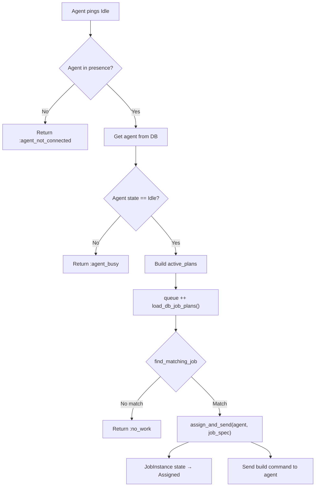
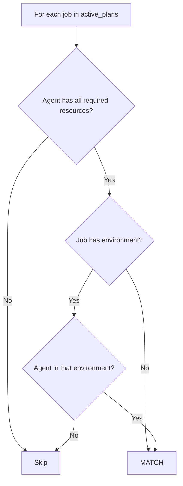
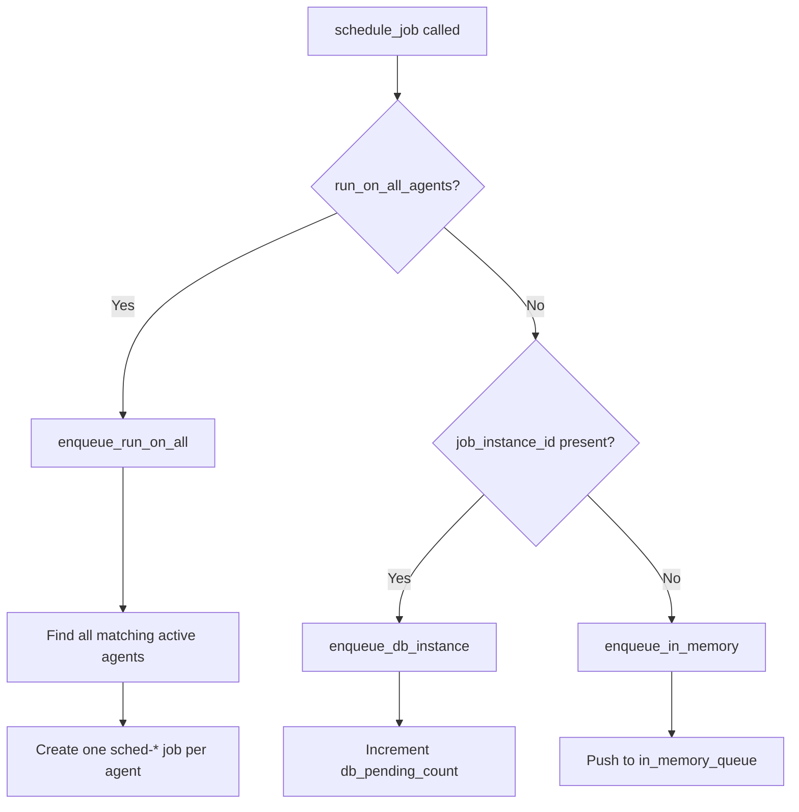
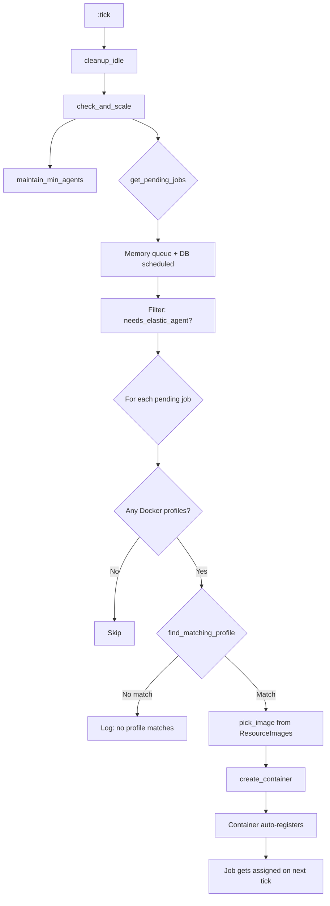
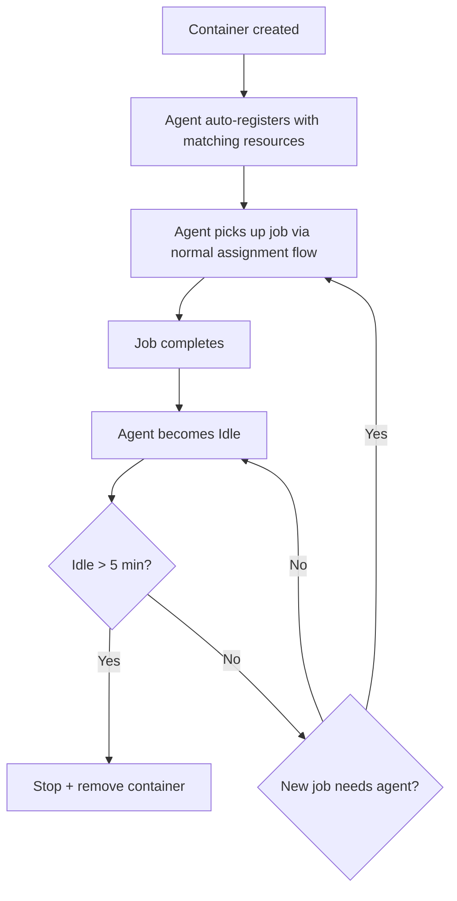
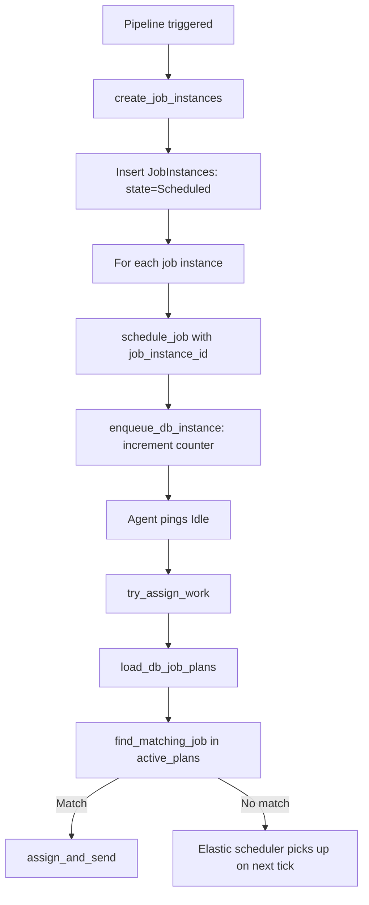

# Job Scheduler Architecture

## Overview

The scheduler is a Horde-distributed singleton GenServer (`ExGoCD.Scheduler`) that manages two
job queues and assigns work to agents. Two elastic agent schedulers provision containers/pods
when no idle static agent can handle a job.

```
┌─────────────────────────────────────────────────────────────────┐
│                        Trigger Sources                           │
│  Pipeline trigger ─► DB insert (state: Scheduled)               │
│  Schedule Job btn ─► in-memory queue                            │
│  Timer/material   ─► Pipeline trigger                           │
└───────────────┬─────────────────────────────────────────────────┘
                │
                ▼
┌─────────────────────────────────────────────────────────────────┐
│                     Scheduler GenServer                          │
│  State: %{in_memory_queue: [...], db_pending_count: N}          │
│                                                                  │
│  Every 5s: reload_db_pending_count(), trigger idle agents       │
│  Agent pings Idle: try_assign_work(agent_uuid)                  │
│                                                                  │
│  ┌──────────────┐    ┌───────────────────────────┐              │
│  │ in-memory     │    │ DB "Scheduled" JobInstances│             │
│  │ queue         │    │ (loaded via load_db_job_plans)│          │
│  │ (sched-* ids) │    │ (db-* ids)                   │          │
│  └──────┬───────┘    └─────────────┬─────────────┘              │
│         └──────────┬──────────────┘                              │
│                    ▼                                              │
│         active_plans = queue ++ load_db_job_plans()              │
│                    │                                              │
│                    ▼                                              │
│         find_matching_job(agent, active_plans)                   │
│         → match by resources & environments                      │
│         → first-come-first-served (FIFO)                         │
└──────────────────────┬──────────────────────────────────────────┘
                       │
                       ▼
              ┌─────────────────┐
              │  Assign to agent │
              │  → send build    │
              │  → update state  │
              └─────────────────┘
```

## Job Lifecycle

```
Scheduled → Assigned → Preparing → Building → Completing → Completed
                │                                       │
                └──── Rescheduled ←─────────────────────┘ (on retry)
```

| State | Meaning | Set by |
|---|---|---|
| Scheduled | Job waiting for an agent | Pipeline trigger, material poll |
| Assigned | An agent accepted the job | `assign_and_send/3` |
| Preparing | Agent checking out code | Agent reports `Preparing` |
| Building | Agent running tasks | Agent reports `Building` |
| Completing | Agent finishing up | Agent reports `Completing` |
| Completed | Job done (Passed/Failed) | Agent reports `reportCompleted` |

## Agent Assignment Flow



### Matching Logic

A job matches an agent when:

- Agent has ALL required resources (case-insensitive)
- Agent is in the job's environment (or job has no environment)
- Agent is enabled (not disabled)



## Two-Tier Queue

| Tier | Source | Storage | ID prefix | Lifecycle |
|---|---|---|---|---|
| **In-memory** | `schedule_job/1`, `run_on_all_agents` | GenServer state | `sched-*` | Lost on restart |
| **DB-scheduled** | Pipeline triggers, material polls | `job_instances` table | `db-*` | Survives restart |

### How Jobs Enter Each Tier



### DB Job Plans (`load_db_job_plans/0`)

On every `try_assign_work`, the scheduler:

1. Queries `job_instances WHERE state = 'Scheduled' ORDER BY id`
2. Preloads `job → stage_instance → pipeline_instance → pipeline`
3. Resolves resources from job config, environments from pipeline membership
4. Returns list of `%{id: "db-N", job_instance_id, pipeline, stage, job, resources, environments}`

This is a live query — stale job plans are never cached.

## Elastic Agent Scheduling

Two schedulers run independently, both using `ElasticSchedulerHelpers`:

| Scheduler | Creates | Profile plugin_id | Connection |
|---|---|---|---|
| `ElasticAgentScheduler` | K8s pods | `ex_gocd.elasticagent.kubernetes` | K8s API |
| `DockerElasticAgentScheduler` | Docker containers | `cd.go.contrib.elastic-agent.docker` | Docker socket |

### Tick Loop (every 30s)



### When Does a Job Need an Elastic Agent?

A job needs an elastic agent when **no IDLE static agent** can handle it:

```elixir
needs_elastic_agent?(job):
  1. Get all idle agents (state == "Idle", not disabled)
  2. Filter by resource match (all job resources must be in agent resources)
  3. Filter by environment match (job env in agent envs, or job has no env)
  4. Return true if NO idle agent matches
```

This means elastic agents scale when static agents are **busy or missing**.

### Profile Matching

```mermaid
flowchart TD
    A[Job resources] --> B{resources empty?}
    B -->|Yes| C[prefer docker-no-resources]
    B -->|No| D[Find profile whose ResourceImages contains a job resource]
    D -->|Found| E[Use that profile]
    D -->|Not found| F[Fallback to first profile]
    E --> G[pick_image: ResourceImages[key] or Image]
```

### Resource→Image Mapping

Each Docker profile has `ResourceImages` in properties:

```json
{
  "Image": "default-image",
  "ResourceImages": {
    "java": "java-agent:21",
    "rust": "rust-elixir-agent:latest"
  }
}
```

When a job needs `["rust"]`, the scheduler picks `rust-elixir-agent:latest`.
When a job needs `["java", "gradle"]`, it picks `java-agent:21`.

### Container Lifecycle



### Minimum Agents (`MinAgents`)

Profiles with `MinAgents > 0` keep standby agents running:

1. `maintain_min_agents` iterates all profiles
2. Counts containers matching each profile
3. Creates standby containers to meet the minimum
4. Standby agents have no build job, just idle

## Key Data Structures

### Job Spec (in-memory queue)

```elixir
%{
  id: "sched-12345",         # or "db-42" for DB jobs
  pipeline: "demo",
  pipeline_counter: 1,
  stage: "build",
  stage_counter: 1,
  job: "default",
  resources: ["java", "gradle"],
  environments: [],
  job_instance_id: 42,       # only for DB jobs
  build_command: [...]       # only for DB jobs
}
```

### Agent (from DB)

```elixir
%ExGoCD.Agents.Agent{
  uuid: "00010000-...",
  hostname: "ci-agent",
  state: "Idle",             # Idle | Building | LostContact
  resources: ["elixir", "postgres"],
  environments: [],
  disabled: false,
  elastic_plugin_id: nil     # set for elastic agents
}
```

## TriggerMonitor

`ExGoCD.SchedulingChecker.TriggerMonitor` (runs every 15s):

1. Finds stages in `Building` state
2. Checks if any "Scheduled" jobs in that stage are unassigned
3. Calls `Scheduler.try_assign_work` for idle agents
4. Also handles auto-trigger of next stage when current stage completes

## Pipeline Trigger → Schedule Flow



## run_on_all_agents

When a job has `run_instances: all`:

1. `enqueue_run_on_all` finds all **active** agents matching resources/envs
2. Creates one in-memory job per matching agent
3. Each gets assigned independently as agents become idle
4. If 0 agents match, 0 jobs are created → elastic scheduler can pick up via DB check

## Configuration

| Setting | Default | Meaning |
|---|---|---|
| `scheduler_reload_interval` | 5000ms | How often to reload DB count + trigger idle agents |
| `DOCKER_ELASTIC_ENABLED` | `true` | Set to `false` to disable Docker elastic scheduler |
| `EX_GOCD_URL` | `http://localhost:4000` | Server URL passed to elastic agents |
| `AGENT_AUTO_REGISTER_KEY` | `ex-gocd-demo-cookie` | Auto-registration key for elastic agents |
